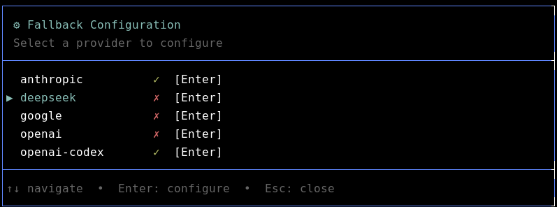
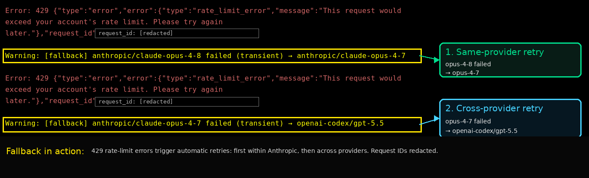

# pi-provider-fallback

A simple cross-provider model fallback extension for [pi](https://github.com/earendil-works/pi-coding-agent), with an interactive TUI config.

When the active model hits a terminal **transient**, **quota**, or **model-unavailable** error, the extension swaps to the next configured fallback model (trying the **same provider first**, then other providers) and re-issues the failed prompt. If fallback switches to a model with a smaller context window, the extension triggers pi compaction first when the current context would be too large. The swap is sticky for the session; the original model is restored on shutdown or at `/reload`.

At a glance:

- This is a **pi extension**. It adds the `/fallback-config` and `/fallback-status` commands.
- Options **draw from your available providers** (those in `pi --list-models`).
- **Providers are enabled for fallback per your preference**: opt each one in or out.
- **Up to two models per provider** can be set as your **1st** and **2nd** fallback preference.

## Install

```bash
# via npm
pi install npm:pi-provider-fallback

# via git
pi install git:github.com/37/pi-provider-fallback
```

This adds the extension to `~/.pi/agent/settings.json` (use `-l` to write project-local `.pi/settings.json` instead).

Alternatively you can install from local, or remote using specific versions pinned to a tag or commit:

```bash
# specific git version
pi install git:github.com/37/pi-provider-fallback@v1.0.3

# Local / dev
pi -e ./provider-fallback.ts   # run once from a clone, no settings change
```

## Usage

Configure interactively in pi:

```
/fallback-config      # interactive TUI to set fallback models per provider
/fallback-status      # view current config
```

### Configuration / setup with TUI

No JSON editing required. The TUI only shows providers and models present in your registry (`pi --list-models`).



A `✓` marks a provider enabled for fallback, `✗` disabled. Press `Enter` on a provider to pick up to two fallback models and assign them priority `1` / `2`.

Note: `/fallback-config` automatically saves changes on every action. No `ctrl+s` required.

## How fallback works

On an eligible error for `providerA/modelX`:
1. Try `providerA`'s other configured fallbacks (priority 1, then 2).
2. If exhausted, try other enabled providers' fallbacks.
3. If nothing is available: `[fallback] no fallback available`.

The pointer is forward-only per session (never retries an already-failed fallback). If the target fallback has a smaller context window and the current context is too large, compaction runs before the retry.



The screenshot shows a rate-limit error falling back first within Anthropic, then across providers after the second rate-limit. Request IDs are redacted.

## Error classification

| Bucket | Triggers fallback | Examples |
|--------|-------------------|----------|
| transient | yes | overloaded, rate-limit, 429/5xx, network/timeout |
| quota | yes | usage limit, billing, insufficient quota |
| unavailable | yes | 404 not_found, "model is not available", invalid model |
| ignore | no | context overflow, user abort |

## Config

Stored at `~/.pi/agent/extensions/provider-fallback.json` (override with `PI_PROVIDER_FALLBACK_CONFIG`). Managed by the TUI; see `provider-fallback.example.json` for the shape.

## Testing fallback

Set your default model to `anthropic/claude-fable-5` and send a prompt. As of **2026-06-21** this is a convenient deterministic test: Anthropic has disabled the model, so it **always 404s** and reliably triggers fallback. This may change in future; if the model is re-enabled or removed, pick any other unavailable model id.

You should see:

```
[fallback] anthropic/claude-fable-5 failed (unavailable) → anthropic/claude-opus-4-8
```

> Note: the `→ anthropic/claude-opus-4-8` target appears only if `claude-opus-4-8` is configured as an `anthropic` fallback model. With a different anthropic fallback (or none, falling through to another provider) the target reflects whatever you configured.

Self-check the classifier: `npx tsx provider-fallback.ts --selfcheck`

## License

MIT
